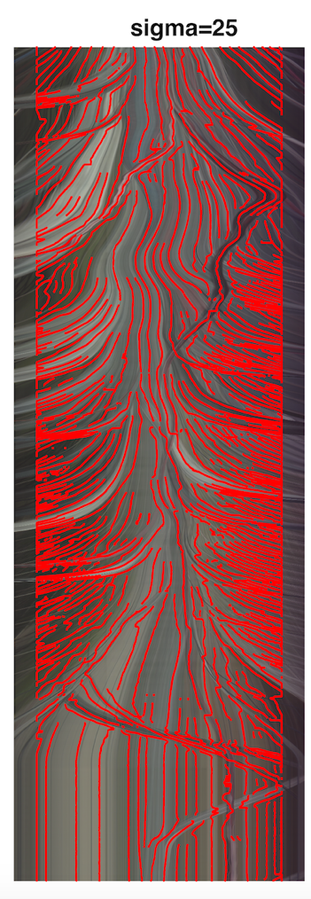

# Pedestrian Detection

本项目旨在在驾驶时对路面行人进行检测，使用到了HOC和深度学习两种方法，Motion profile这个方法在这个项目中起了比较大的作用。

以下是一个motion profile的示例：

## Motion profile原理

根据透视原理，景物会最终汇聚到一点(Focus of Expansion, FOE)，因此我们可以提取过该点水平线下的景物，这样基本上包括了所有跟人有关的事件。

把水平线以下分成三块，分成远中近三个区域，每个区域内的像素求平均值。对每一帧，一个区域形成1x1280的数据，2D->1D. 1280是图像宽度.

对于一整个视频，把所有帧算出的值叠加起来，形成一个图，称之为motion profile。Motion profile能直观反映物体的运动.

## Motion profile的处理

为了更好的使用Motion profile, 我们使用合适参数的Laplace Gaussian filter对图像进行滤波，提取合适宽度的条带。

下图为拉普拉斯-高斯滤波图形：

下面为滤波结果：

## Motion profile应用

1.密集化训练样本

2.用于减少deep learning 的inference阶段搜索遍历的数目，提高效率

3.后期检验效果阶段可以拿ground truth的motion profile和预测的行人的motion profile图做直观对比。

下面两张图分别为使用路径追踪算法计算出的行人轨迹图和所有可能的路径。

## HOC 和 深度学习训练

todo